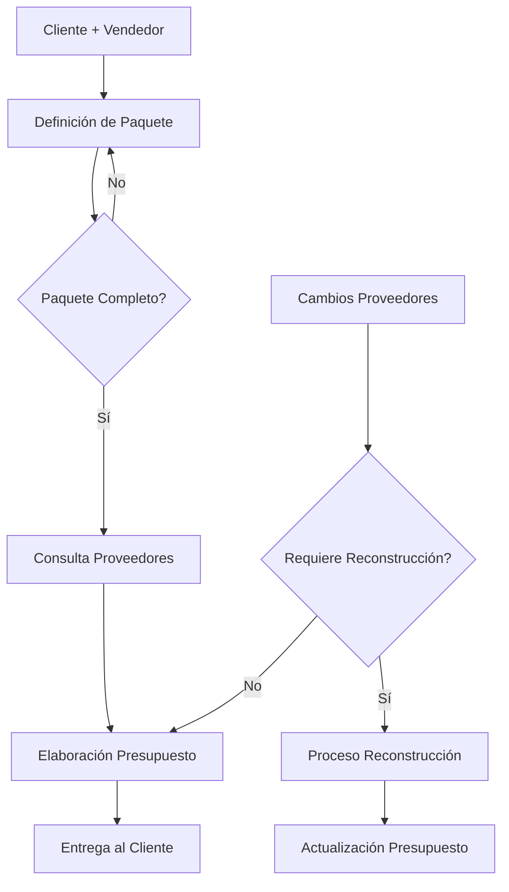
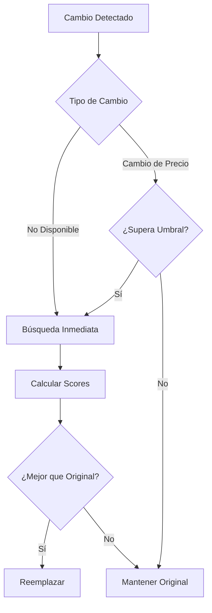

# Sistemas del Smart Travel Agent

Este documento describe en detalle los diferentes sistemas que componen el Smart Travel Agent.

## Sistema de Sugerencias

### 🎯 Propósito
Sistema diseñado para optimizar presupuestos de viaje de forma automática, proporcionando sugerencias inteligentes al vendedor durante la construcción del presupuesto.

### 🔍 Tipos de Sugerencias

#### 1. 💰 Optimización de Costos
- **Activación**: Items con costo > $1000 USD
- **Objetivo**: Encontrar alternativas más económicas
- **Ahorro Potencial**: Hasta 20%
- **Acción**: Botón "Ver Alternativa"
- **Uso**: Ideal para ajustarse al presupuesto del cliente sin sacrificar calidad

#### 2. 📅 Temporada
- **Activación**: Items marcados como temporada alta
- **Objetivo**: Sugerir fechas alternativas más económicas
- **Ahorro Potencial**: Hasta 30%
- **Acción**: Botón "Cambiar Fecha"
- **Uso**: Optimizar costos mediante selección inteligente de fechas

#### 3. 📦 Paquetes
- **Activación**: Múltiples items del mismo proveedor
- **Objetivo**: Combinar items en paquetes con descuento
- **Ahorro Potencial**: Hasta 15%
- **Acción**: Botón "Ver Paquete"
- **Uso**: Aprovechar descuentos por volumen o paquetes predefinidos

### 💻 Implementación Técnica

```python
# Generación de Sugerencias
def _generate_suggestions(self) -> List[str]:
    suggestions = []
    
    # Análisis de costos
    for item in self.items:
        if item.amount > Decimal('1000'):
            suggestions.append(f"💰 Hay una alternativa más económica para '{item.description}' que podría ahorrar hasta un 20%")
    
    # Análisis de temporada
    for item in self.items:
        if item.metadata.get('season') == 'high':
            suggestions.append(f"📅 El item '{item.description}' es más económico en temporada media. Cambiar la fecha podría ahorrar hasta 30%")
    
    # Análisis de paquetes
    provider_items = {}
    for item in self.items:
        provider = item.metadata.get('provider_id')
        if provider:
            provider_items.setdefault(provider, []).append(item)
    
    for provider, items in provider_items.items():
        if len(items) >= 2:
            descriptions = [item.description for item in items]
            suggestions.append(f"📦 Hay un paquete disponible que incluye: {', '.join(descriptions)}. Ahorro potencial del 15%")
```

### 📱 Interfaz de Usuario
- **Dashboard**: Visualización categorizada de sugerencias
- **Expansores**: Agrupación por tipo de sugerencia
- **Botones de Acción**: Acciones específicas para cada tipo
- **Feedback Visual**: Íconos y colores para mejor UX

### 📋 Guía para el Vendedor

#### Flujo de Trabajo
1. Agregar items al presupuesto normalmente
2. El sistema genera sugerencias automáticamente
3. Revisar sección "🎯 Sugerencias de Optimización"
4. Expandir categorías relevantes
5. Usar botones de acción según necesidad

#### Ejemplo de Uso
```
1. Vendedor agrega "Hotel de Lujo en Cancún" ($1500)
2. Sistema sugiere alternativa económica (-20%)
3. Vendedor agrega dos tours del mismo proveedor
4. Sistema sugiere paquete combinado (-15%)
5. Vendedor explora alternativas usando botones de acción
```

### 🎁 Beneficios
- Ahorro de tiempo en búsqueda de alternativas
- Optimización automática de costos
- Mejor servicio al cliente
- Aprovechamiento de descuentos
- Decisiones informadas basadas en datos

### 🔄 Mantenimiento
- Actualizar umbrales de precio según inflación
- Ajustar porcentajes de ahorro según datos reales
- Mantener lista de proveedores actualizada
- Revisar efectividad de sugerencias periódicamente

## SISTEMA DE PRESUPUESTOS DE VIAJE

## 1. PROCESO GENERAL

### 1.1 Interacción Inicial
- Cliente contacta al vendedor
- Vendedor utiliza nuestra herramienta
- Se inicia proceso de definición

### 1.2 Definición del Paquete
1. **Requerimientos Base**
   - Destino específico
   - Fechas de viaje
   - Cantidad de pasajeros
   - Preferencias generales

2. **Componentes a Definir**
   - Vuelos disponibles
   - Alojamiento requerido
   - Traslados necesarios
   - Excursiones deseadas
   - Servicios adicionales

### 1.3 Consulta a Proveedores
- Sistema conecta con dos proveedores principales
- Obtiene datos reales de:
  * Disponibilidad actual
  * Tarifas vigentes
  * Opciones disponibles

### 1.4 Elaboración del Presupuesto
1. **Condiciones Previas**
   - Paquete completamente definido
   - Componentes confirmados
   - Datos de proveedores actualizados

2. **Proceso de Armado**
   - Integración de componentes
   - Cálculo de costos
   - Aplicación de márgenes
   - Generación de presupuesto formal

## 2. RECONSTRUCCIÓN DE PRESUPUESTOS

### 2.1 Cuándo se Activa
- Cambios confirmados de proveedores
- Modificaciones en componentes
- Ajustes en servicios solicitados

### 2.2 Proceso de Reconstrucción
1. **Validación Inicial**
   - Verificar paquete completo
   - Confirmar cambios de proveedores
   - Evaluar impacto

2. **Estrategias de Reconstrucción**
   - PRESERVE_PACKAGE
     * Mantiene estructura original
     * Actualiza precios/disponibilidad
   
   - FIND_ALTERNATIVES
     * Busca opciones similares
     * Mantiene nivel de servicio
   
   - ADJUST_SERVICES
     * Modifica servicios si necesario
     * Mantiene objetivo del paquete

3. **Resultado**
   - Presupuesto actualizado
   - Cambios documentados
   - Alternativas si aplica

## 3. COMPONENTES DEL SISTEMA

### 3.1 Core (reconstructor.py)
- Maneja la lógica de reconstrucción
- Aplica estrategias definidas
- Mantiene integridad del paquete

### 3.2 Proveedores
- Conexión con sistemas externos
- Datos actualizados
- Confirmación de disponibilidad

### 3.3 Gestión de Presupuestos
- Almacenamiento de versiones
- Historial de cambios
- Control de estados

## 4. PRINCIPIOS DEL SISTEMA

### 4.1 Prioridades
1. Integridad del Paquete
   - Mantener estructura definida
   - Respetar preferencias del cliente

2. Datos Reales
   - Trabajar con información confirmada
   - Validar con proveedores

3. Claridad
   - Documentar cambios
   - Mantener historial
   - Facilitar seguimiento

### 4.2 Restricciones
- No modificar sin confirmación
- Mantener coherencia de servicios
- Respetar niveles de servicio

## 5. FLUJO DE TRABAJO



## 6. NOTAS IMPORTANTES

1. **Presupuesto Inicial**
   - Solo se genera con paquete completo
   - Requiere datos confirmados
   - Debe incluir todos los servicios

2. **Reconstrucción**
   - Proceso controlado
   - Mantiene estructura base
   - Documenta todos los cambios

3. **Validaciones**
   - Datos de proveedores actualizados
   - Disponibilidad confirmada
   - Servicios coherentes

## Sistema de Reconstrucción - BEST_ALTERNATIVE

### 🎯 Propósito
Algoritmo para encontrar las mejores alternativas cuando un presupuesto necesita ser reconstruido, ya sea por indisponibilidad o cambios significativos en precios.

### 📈 Evolución del Algoritmo

#### Fase 1 - Búsqueda Proactiva y Score Básico
- **Estado**: ✅ Implementado
- **Características**:
  * Búsqueda proactiva de alternativas
  * Sistema de scoring básico
  * Logging detallado de decisiones

##### Casos de Búsqueda
1. **Indisponibilidad**:
   - Cuando un item ya no está disponible
   - Búsqueda inmediata de alternativas similares

2. **Cambios de Precio**:
   - Monitoreo de cambios significativos
   - Umbral configurable (default: 15%)
   - Búsqueda proactiva si se supera el umbral

##### Sistema de Scoring
- **Componentes**:
  * Precio (40%): Menor precio = mejor score
  * Rating (40%): Mayor rating = mejor score
  * Disponibilidad (20%): Mayor disponibilidad = mejor score

- **Ejemplo**:
  ```python
  # Cálculo de score para un hotel
  hotel_score = (
      (1/precio) * 0.4 +      # Factor precio
      (rating/5) * 0.4 +      # Factor rating
      disponibilidad * 0.2    # Factor disponibilidad
  )
  ```

##### Proceso de Decisión
1. Detectar necesidad de alternativa
2. Buscar opciones disponibles
3. Calcular scores
4. Comparar con item original
5. Reemplazar solo si hay mejora

#### Próximas Fases
- **Fase 2**: Preferencias del Cliente
  * Incorporar preferencias en scoring
  * Ponderación personalizada
  * Historial de selecciones

- **Fase 3**: Optimización Global
  * Caché de alternativas
  * Optimización de presupuesto total
  * Machine learning para mejores predicciones

### 🔄 Flujo de Trabajo



### 📊 Métricas de Éxito
- Tasa de alternativas encontradas
- Mejora promedio en scores
- Tiempo de búsqueda
- Satisfacción del cliente

### 🔍 Logging y Monitoreo
- Registro detallado de decisiones
- Razones de cambios
- Comparativas de scores
- Tracking de mejoras

## Sistema de Reconstrucción de Presupuestos

### Arquitectura y Responsabilidades

```
core/budget/
├── reconstructor.py           # Implementación CORE
└── reconstruction/           # Características de alto nivel
    ├── __init__.py
    ├── analysis.py          # Análisis de impacto
    ├── manager.py           # Gestión de alto nivel
    ├── session_manager.py   # Manejo de sesiones
    └── strategies.py        # Implementación de estrategias
```

#### 1. Core Implementation (reconstructor.py)
- Lógica fundamental de reconstrucción
- Manejo de memoria y optimización
- Implementación base de estrategias
- Control de estabilidad durante sesiones
- Métricas y logging detallado

#### 2. High-Level Features (reconstruction/)
- **analysis.py**: Análisis predictivo de impacto
- **manager.py**: Orquestación del proceso completo
- **session_manager.py**: Control de sesiones activas
- **strategies.py**: Estrategias avanzadas y extensibles

### Principios de Diseño

1. **Estabilidad en Sesiones Activas**
   - Prioridad máxima durante interacción vendedor-cliente
   - Control estricto de cambios durante sesión
   - Validación de impacto antes de cambios

2. **Estrategias de Reconstrucción**
   - PRESERVE_MARGIN: Mantiene margen de ganancia
   - PRESERVE_PRICE: Mantiene precio final
   - ADJUST_PROPORTIONALLY: Ajuste balanceado
   - BEST_ALTERNATIVE: Búsqueda inteligente

3. **Manejo de Datos**
   - Versionado completo de cambios
   - Cache inteligente para optimización
   - Validación en múltiples niveles
   - Rollback seguro en caso de error

4. **Extensibilidad**
   - Diseño modular para nuevas estrategias
   - Interfaces claras entre componentes
   - Métricas extensibles por módulo
   - Logging configurable por nivel

### Reglas de Modificación

1. **NO modificar reconstructor.py sin:**
   - Documentación detallada del cambio
   - Tests exhaustivos de regresión
   - Análisis de impacto en módulos superiores

2. **Extensiones vía reconstruction/:**
   - Nuevas estrategias en strategies.py
   - Análisis adicional en analysis.py
   - Mejoras de sesión en session_manager.py

3. **Manejo de Dependencias**
   - Core → Alto Nivel (nunca al revés)
   - Evitar dependencias circulares
   - Documentar cualquier excepción

### Métricas y Monitoreo

1. **Métricas Críticas**
   - Tiempo de reconstrucción
   - Éxito/fallo de estrategias
   - Estabilidad de sesiones
   - Impacto en márgenes

2. **Alertas**
   - Fallos en reconstrucción
   - Sesiones inestables
   - Cambios de precio significativos
   - Errores en estrategias

### Próximas Mejoras

1. **Optimizaciones**
   - Cache distribuido para reconstrucciones
   - Paralelización de análisis
   - Predicción de impacto mejorada

2. **Nuevas Características**
   - Estrategias basadas en ML
   - Análisis predictivo avanzado
   - Dashboard en tiempo real

## Sistema de Métricas

### 🎯 Propósito
Sistema de monitoreo y métricas para seguimiento de operaciones y rendimiento del sistema.

### 📊 Componentes Principales

#### 1. Registro de Métricas
- **Registro Único**: Todas las métricas se registran en un `CollectorRegistry` centralizado
- **Prevención**: Evita duplicación de métricas
- **Gestión**: Facilita la administración y consulta

#### 2. Tipos de Métricas
- **Operaciones**: Contador de operaciones por proveedor
- **Latencia**: Histograma de tiempos de respuesta
- **Monitores Activos**: Medidor de monitores en ejecución
- **Cambios de Precio**: Histograma de variaciones porcentuales

### 💻 Implementación

```python
# Configuración del registro
REGISTRY = CollectorRegistry()

# Ejemplo de métrica
PROVIDER_OPERATIONS = Counter(
    'provider_operations',
    'Número de operaciones por proveedor',
    ['provider_name', 'operation_type'],
    registry=REGISTRY
)
```

### 🔄 Mantenimiento
- Monitoreo regular de métricas
- Ajuste de buckets según necesidad
- Limpieza periódica de datos antiguos

## Sistema de Notificaciones

### 🎯 Propósito
Sistema de notificaciones en tiempo real para mantener al vendedor informado sobre cambios importantes en presupuestos y servicios.

### 🔍 Componentes

#### 1. Notificaciones Emergentes
- **Propósito**: Alertas inmediatas para cambios críticos
- **Activación**: Cambios de precio significativos, problemas de disponibilidad
- **Visibilidad**: Prominente en la interfaz
- **Interacción**: Botón de cierre y marcado como leído

#### 2. Barra de Estado
- **Ubicación**: Parte superior del dashboard
- **Contenido**: Contadores por tipo de severidad
- **Categorías**: 
  * ⚠️ Críticas (rojo)
  * 📢 Importantes (amarillo)
  * ℹ️ Informativas (azul)

#### 3. Panel Lateral
- **Funcionalidad**: Historial completo de notificaciones
- **Filtros**:
  * Por tipo de notificación
  * Por severidad
  * Estado de lectura
- **Ordenamiento**: Cronológico inverso
- **Detalles**: Expandible para cada notificación

### 💻 Implementación Técnica

```python
@dataclass
class Notification:
    type: NotificationType
    message: str
    severity: NotificationSeverity
    timestamp: datetime
    data: Optional[Dict] = None
    read: bool = False
```

### 📱 Interfaz de Usuario

#### Flujo de Notificaciones
1. Generación de notificación
2. Aparición como alerta emergente (si es crítica)
3. Actualización de contadores en barra superior
4. Registro en panel lateral

#### Gestión
- Marcado como leído
- Filtrado por categorías
- Visualización de detalles
- Historial persistente

### 🔄 Ciclo de Vida

1. **Creación**
   ```python
   notification = Notification(
       type=NotificationType.PRICE_CHANGE,
       message="Cambio de precio detectado",
       severity=NotificationSeverity.HIGH
   )
   ```

2. **Distribución**
   ```python
   manager.add_notification(notification)
   ```

3. **Presentación**
   - Emergente si es crítica
   - Actualización de contadores
   - Agregado al historial

4. **Gestión**
   - Marcado como leído
   - Filtrado
   - Archivado automático

### 📋 Mejores Prácticas

1. **Priorización**
   - Usar severidad apropiadamente
   - No saturar con notificaciones
   - Agrupar notificaciones relacionadas

2. **Contenido**
   - Mensajes claros y concisos
   - Incluir datos relevantes
   - Acciones recomendadas

3. **Mantenimiento**
   - Limpieza periódica
   - Ajuste de umbrales
   - Monitoreo de efectividad
