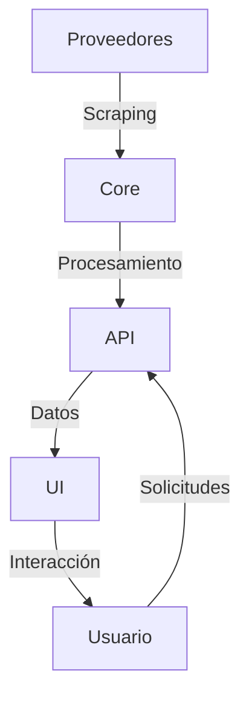

# Arquitectura SmartTravelAgent

## Visión General

SmartTravelAgent es un sistema diseñado para automatizar y optimizar el proceso de elaboración de presupuestos de viaje, con énfasis en la extracción y procesamiento de datos en tiempo real.

## Componentes del Sistema

### 1. Core (agent_core/)

#### 1.1 Scrapers 
- **Base Framework** (IMPRESCINDIBLE)
  ```
  base.py
  session_manager.py
  change_detector.py
  ```
  - Manejo de sesiones y anti-bloqueo
  - Detección de cambios en datos
  - Framework base para todos los scrapers

- **Implementaciones Específicas**
  ```
  ola_scraper.py
  [otros_proveedores]_scraper.py
  ```
  - Lógica específica para cada proveedor
  - Selectores y mapeo de datos
  - Manejo de autenticación

#### 1.2 Schemas
- **Modelos de Datos**
  ```
  travel.py
  providers.py
  ```
  - Estructuras de datos validadas
  - Modelos Pydantic
  - Conversión y normalización

### 2. API y Servicios

#### 2.1 Endpoints REST
- `/api/v1/packages/search`
- `/api/v1/packages/compare`
- `/api/v1/budgets/create`
- `/api/v1/budgets/update`

#### 2.2 Servicios Asíncronos
- Actualización de precios
- Monitoreo de cambios
- Notificaciones

### 3. Interfaz de Usuario

#### 3.1 Dashboard Principal
- Vista general de presupuestos
- Alertas y notificaciones
- Métricas clave

#### 3.2 Módulo de Búsqueda
- Búsqueda de paquetes
- Filtros y ordenamiento
- Comparación de opciones

#### 3.3 Gestión de Presupuestos
- Creación y edición
- Historial de cambios
- Exportación de documentos

## Priorización de Desarrollo

### 1. IMPRESCINDIBLE 
- Framework base de scraping
- Manejo de sesiones y anti-bloqueo
- Modelos de datos core
- Endpoints básicos de API

### 2. PARCIALMENTE NECESARIO 
- Sistema simple de detección de cambios
- Notificaciones básicas
- UI elementos esenciales

### 3. OMITIBLE 
- Optimizaciones avanzadas
- Caché complejo
- Características no críticas

## Flujo de Datos



## Consideraciones Técnicas

### 1. Seguridad
- Manejo seguro de credenciales
- Rate limiting
- Validación de datos

### 2. Rendimiento
- Scraping eficiente
- Procesamiento asíncrono
- Optimización de consultas

### 3. Mantenibilidad
- Código modular
- Pruebas automatizadas
- Documentación actualizada

## Pruebas

### 1. Unit Tests
```bash
python -m pytest tests/
```
- Componentes individuales
- Mocking de servicios externos
- Validación de modelos

### 2. Integration Tests
```bash
python -m pytest tests/integration/
```
- Flujos completos
- Interacción entre componentes
- Casos de uso reales

## Despliegue

### 1. Desarrollo
```bash
python -m uvicorn main:app --reload
```

### 2. Producción
```bash
docker-compose up -d
```

## Monitoreo

### 1. Logs
- Nivel INFO: Operaciones normales
- Nivel WARNING: Cambios significativos
- Nivel ERROR: Fallos y excepciones

### 2. Métricas
- Tiempo de respuesta
- Tasa de éxito en scraping
- Uso de recursos

## Mantenimiento

### 1. Actualizaciones Regulares
- Selectores de scraping
- User agents
- Dependencias

### 2. Backups
- Datos de presupuestos
- Configuraciones
- Logs históricos
