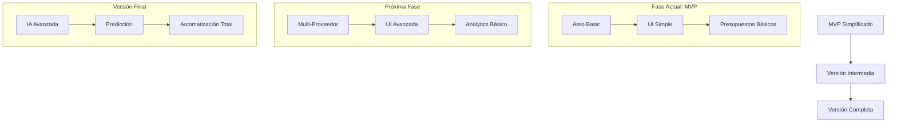

# Mapa de Evolución del Proyecto

## Visión General

Este documento mapea la evolución del proyecto desde su versión MVP simplificada hasta su versión completa de máxima, permitiendo visualizar el progreso y mantener el enfoque en los objetivos finales.

## 1. MVP Simplificado (ACTUAL)

### Componentes Básicos
- ✅ Scraping simple con requests/BeautifulSoup
- ✅ Almacenamiento en SQLite
- ✅ UI básica con Streamlit
- 🔄 Proveedor Aero (en desarrollo)

### Funcionalidades Esenciales
- Búsqueda básica de vuelos y hoteles
- Generación de presupuestos simple
- Interfaz de usuario minimalista
- Caché en memoria

## 2. Versión Intermedia (PRÓXIMA)

### Mejoras Planificadas
- Integración multi-proveedor
- Sistema de caché con Redis
- UI mejorada con más opciones
- API REST básica
- Monitoreo simple

### Características Adicionales
- Comparación de precios
- Histórico de búsquedas
- Exportación de presupuestos
- Autenticación básica

## 3. Versión Completa (OBJETIVO FINAL)

### Sistema Avanzado
- 🎯 IA para recomendaciones
- 🎯 Predicción de precios
- 🎯 Automatización completa
- 🎯 Dashboard analítico

### Características Premium
- Análisis predictivo de mercado
- Sistema de recomendaciones IA
- Automatización de decisiones
- Monitoreo avanzado
- API completa para integraciones

## Matriz de Evolución

| Componente | MVP (Actual) | Intermedio | Completo |
|------------|--------------|------------|-----------|
| **Proveedores** | Aero básico | +Ola | Múltiples |
| **UI** | Streamlit básico | +Gráficos | Dashboard completo |
| **Storage** | SQLite | +Redis | Distribuido |
| **Cache** | En memoria | Redis simple | Redis cluster |
| **API** | No | REST básica | REST + GraphQL |
| **ML/IA** | No | Básico | Avanzado |
| **Monitoreo** | Logs básicos | +Métricas | Full observability |

## Estado Actual vs Objetivo Final

### Componentes en Simplificación
1. **Sistema de Monitoreo**
   - Actual: FastAPI + Prometheus
   - MVP: Logs básicos
   - Final: Full observability

2. **Cache**
   - Actual: Redis
   - MVP: TTLCache
   - Final: Redis cluster

3. **Auth**
   - Actual: Sistema complejo
   - MVP: Basic auth
   - Final: OAuth + RBAC

### Componentes en Desarrollo
1. **Proveedor Aero**
   - Actual: En desarrollo
   - MVP: Búsqueda básica
   - Final: Integración completa

2. **UI**
   - Actual: Streamlit básico
   - MVP: Forms simples
   - Final: Dashboard analítico

## Plan de Evolución

### Corto Plazo (1-2 meses)
1. ⏳ Completar simplificación
2. ⏳ Implementar Aero básico
3. ⏳ UI búsqueda simple

### Mediano Plazo (2-4 meses)
1. 📅 Agregar Ola
2. 📅 Mejorar UI
3. 📅 Implementar Redis

### Largo Plazo (4+ meses)
1. 🎯 Sistemas IA
2. 🎯 Predicción precios
3. 🎯 Automatización

## Métricas de Progreso

### MVP (Actual)
- ⭐ Búsqueda básica funcional
- ⭐ Presupuestos simples
- ⭐ UI navegable

### Intermedio
- 📈 Multi-proveedor
- 📈 Caché eficiente
- 📈 API documentada

### Completo
- 🌟 IA predictiva
- 🌟 Automatización
- 🌟 Analytics avanzado

## Notas Importantes

1. **Durante la Simplificación**
   - Mantener código modular
   - Documentar decisiones
   - Pruebas básicas

2. **Hacia Versión Final**
   - Escalabilidad
   - Mantenibilidad
   - Extensibilidad

3. **No Perder de Vista**
   - Experiencia usuario
   - Rendimiento
   - Seguridad
