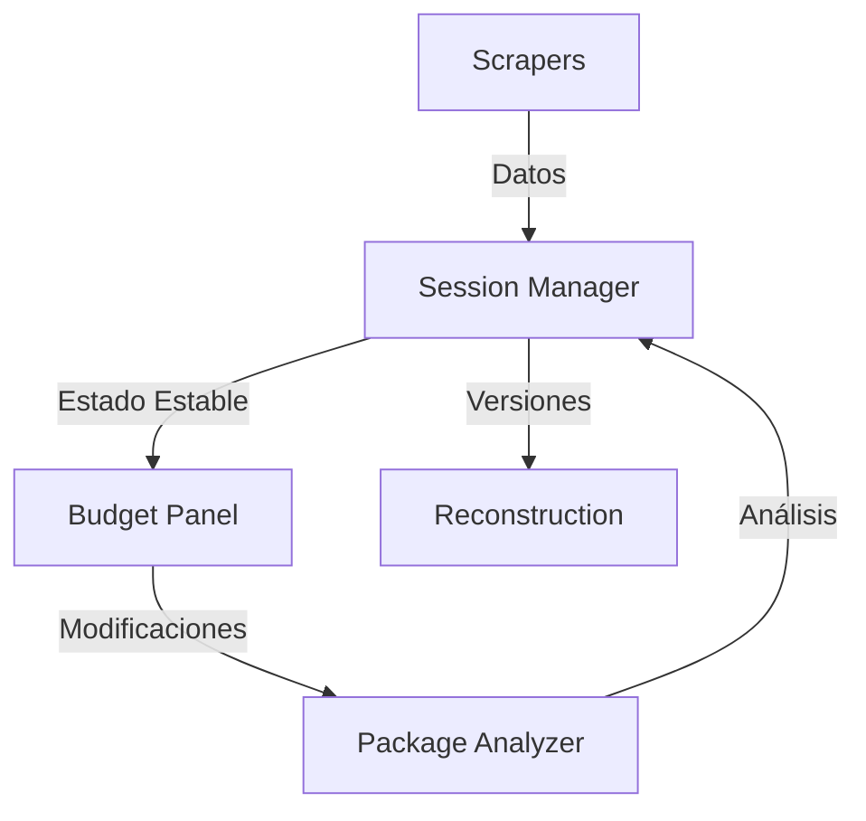

# Componentes del SmartTravelAgent

## 1. Componentes Existentes

### 1.1 Sistema de Scraping (✅ IMPLEMENTADO)
- **Ubicación**: `/agent_core/scrapers/`
- **Archivos**:
  - `base.py`: Framework base para scrapers
  - `ola_scraper.py`: Implementación para OLA
  - `change_detector.py`: Detector de cambios
  - `error_handler.py`: Manejo de errores
  - `validators.py`: Validaciones
  - `realtime_validator.py`: Validación en tiempo real
  - `session_manager.py`: Gestión de sesiones

- **Responsabilidades**:
  1. Extracción de datos de proveedores
  2. Detección de cambios
  3. Validación de datos
  4. Manejo de errores
  5. Control de sesiones

### 1.2 Gestión de Sesiones (✅ IMPLEMENTADO)
- **Ubicación**: `/agent_core/managers/`
- **Archivos**:
  - `session_budget_manager.py`: Gestión de presupuestos
  - `storage_manager.py`: Almacenamiento

- **Responsabilidades**:
  1. Control de sesiones activas
  2. Estabilidad de datos durante sesión
  3. Almacenamiento de presupuestos
  4. Control de modificaciones

### 1.3 Análisis de Paquetes (✅ IMPLEMENTADO)
- **Ubicación**: `/smart_travel_agency/core/`
- **Archivos**:
  - `package_analyzer.py`: Análisis de paquetes

- **Responsabilidades**:
  1. Análisis de precios
  2. Comparación con criterios
  3. Evaluación de servicios
  4. Generación de puntuaciones

### 1.4 Interfaz de Vendedor (✅ IMPLEMENTADO)
- **Ubicación**: `/src/dashboard/`
- **Archivos**:
  - `templates/budget_panel.html`: Panel principal
  - `budget_panel.py`: Controlador

- **Responsabilidades**:
  1. Visualización de presupuestos
  2. Control de modificaciones
  3. Análisis de paquetes
  4. Interacción del vendedor

## 2. Componentes Faltantes

### 2.1 Sistema de Reconstrucción (❌ PENDIENTE)
- **Ubicación Propuesta**: `/agent_core/reconstruction/`
- **Archivos Necesarios**:
  - `version_manager.py`: Control de versiones
  - `history_manager.py`: Historial de cambios
  - `budget_builder.py`: Reconstrucción

- **Responsabilidades**:
  1. Versionado de presupuestos
  2. Historial de modificaciones
  3. Reconstrucción de estados previos
  4. Comparación de versiones

### 2.2 Integración de Componentes (❌ PENDIENTE)
- **Ubicación Propuesta**: `/agent_core/integration/`
- **Archivos Necesarios**:
  - `scraping_integration.py`: Integración con scrapers
  - `session_integration.py`: Integración con sesiones

- **Responsabilidades**:
  1. Conexión entre scraping y sesiones
  2. Control de actualizaciones
  3. Manejo de cambios entre sesiones
  4. Sincronización de datos

## 3. Flujo de Datos

## 4. Prioridades de Implementación

### 4.1 IMPRESCINDIBLE (✅)
1. Sistema de Reconstrucción
   - Control de versiones
   - Historial de cambios
   - Capacidad de reconstrucción

2. Integración de Componentes
   - Conexión scraping-sesiones
   - Control de actualizaciones

### 4.2 PARCIALMENTE NECESARIO (⚠️)
1. Mejoras en la interfaz
2. Optimizaciones de rendimiento

### 4.3 OMITIBLE (❌)
1. Visualizaciones complejas
2. Procesamiento en background
3. Sistema de eventos
